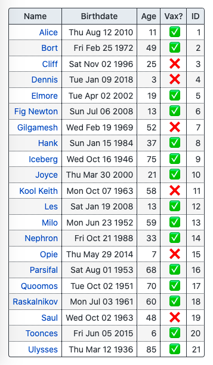
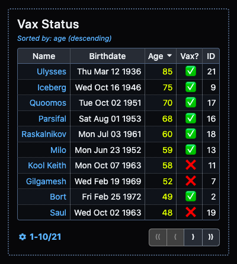
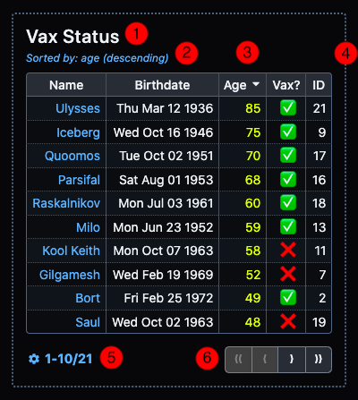

# svelte-simple-tables

    [](https://codecov.io/gh/a-luna/svelte-simple-tables)

- [Features](#features)
- [Examples](#examples)
- [Installation](#installation)
- [Usage](#usage)
  - [`data`](#data)
  - [`columnSettings`](#columnsettings)
  - [`tableSettings`](#tablesettings)
- [Themes](#themes)
  - [CSS Custom Properties](#css-custom-properties)

## Features

- **Create sortable, paginated tables** that follow [WAI-ARIA guidelines](https://www.w3.org/TR/wai-aria-practices-1.1/examples/table/table.html).
- **Columns dynamically resize** to accommodate all visible content.
- **Automatically responsive.** Tables become horizontally scrollable without breaking page layout.
- **Four color themes provided**. Users can adjust every detail of existing themes or create new themes with CSS custom properties.

## Examples

- [svelte-simple-tables docs site](https://svelte-simple-tables.netlify.app/)
- Coming Soon: CSS Theme Editor

## Installation

**yarn**

```shell
yarn add -D @a-luna/svelte-simple-tables
```

**npm**

```shell
npm install -D @a-luna/svelte-simple-tables
```

**pnpm**

```shell
pnpm install -D @a-luna/svelte-simple-tables
```

## Usage

```html
<script lang="ts">
	import SimpleTable from '@a-luna/svelte-simple-tables';
	import type { TableSettings } from '@a-luna/svelte-simple-tables/types';
	import { columnSettings } from './columnSettings';
	import type { VaxData } from './data';
	import { data } from './data';

	const tableSettings: TableSettings<VaxData> = {
		tableId: 'vax-status-table',
		themeName: 'darker',
		sortBy: 'age',
		sortDir: 'desc',
		showHeader: true,
		header: 'Vax Status',
		showSortDescription: true,
		tableWrapper: true,
		expandToContainerWidth: true,
		paginated: true,
		pageSize: 10,
		pageSizeOptions: [5, 10, 15, 20, 25],
		pageRangeFormat: 'compact',
		pageNavFormat: 'compact',
		rowType: 'vax records',
	};
</script>

<SimpleTable {data} {columnSettings} {tableSettings} />
```

`SimpleTable` expects three props: `data`, `columnSettings`, and `tableSettings`:

| Name             | Type                        | Description                                                                                                                                                                                                                                                                                                                   |
| ---------------- | --------------------------- | ----------------------------------------------------------------------------------------------------------------------------------------------------------------------------------------------------------------------------------------------------------------------------------------------------------------------------- |
| `data`           | `T[]`                       | Array of `T` objects (`T` is a generic type) . Each object will be rendered as a row in the table.                                                                                                                                                                                                                            |
| `columnSettings` | `ColumnSettings<VaxData>[]` | Array of `ColumnSettings<VaxData>` objects (`T` is the same generic type from `data`). You must define a `ColumnSettings<VaxData>` object for every column your table contains. Each `ColumnSettings<VaxData>` object specifies the value to display in the column for each row, the value to show in the column header, etc. |
| `tableSettings`  | `TableSettings<VaxData>`    | Configuration object for sizing, layout, pagination, and other overall table settings (Again, `T` is the same generic type from `data`).                                                                                                                                                                                      |

### `data`

The `data` for your table will typically be provided from a response to an API request or database query. In this example, `data` is imported from a typescript file (`data.ts`) that exports a list of `VaxData` objects:

```typescript
// data.ts
interface VaxData {
	personId: number;
	name: string;
	age: number;
	birthdate: Date;
	vaccinated: boolean;
}

export const data: VaxData[] = [
	{
		personId: 1,
		name: 'Alice',
		age: 11,
		birthdate: new Date(2010, 7, 12),
		vaccinated: true,
	},
	...// contains 21 items, only showing first and last item for brevity
	{
		personId: 21,
		name: 'Ulysses',
		age: 85,
		birthdate: new Date(1936, 2, 12),
		vaccinated: true,
	},
];
```

> 😨 **BUT I DON'T WANT TO USE TYPES** Why is it necessary to specify the type of the items in the `data` array? `SimpleTable` uses [an experimental svelte feature](https://github.com/dummdidumm/rfcs/blob/ts-typedefs-within-svelte-components/text/ts-typing-props-slots-events.md) that makes it possible to use generic types with component props. This enables advanced error-checking and autocompletion in your IDE.

### `columnSettings`

After you have the `data` that you wish to display in a table, the next step is to determine which `VaxData` properties (`name`, `age`, etc.) should be displayed in each column. This is accomplished with the `columnSettings` prop, which is a list of `ColumnSettings<VaxData>` objects. The API for `ColumnSettings<VaxData>` is given below:

| Property     | Type                 | Required | Default                                                                                                                                                                                                                  | Description                                                                                                                                                                                                                                        |
| ------------ | -------------------- | -------- | ------------------------------------------------------------------------------------------------------------------------------------------------------------------------------------------------------------------------ | -------------------------------------------------------------------------------------------------------------------------------------------------------------------------------------------------------------------------------------------------- |
| `propName`   | `keyof T`            | ✅       | N/A                                                                                                                                                                                                                      | The name of the property to display (value must be the name of a property on type `T`)                                                                                                                                                             |
| `headerText` | `string`             | ❌       | If the value provided for `propName` is in `snake_case` or `camelCase` format, it is converted to `Snake Case` or `Camel Case`, respectively. Otherwise, the value provided for `propName` is used as the default value. | The text displayed in the column header.                                                                                                                                                                                                           |
| `tooltip`    | `string`             | ❌       | Same behavior as `headerText`                                                                                                                                                                                            | Tooltip value to display when mouse hovers over the column header.                                                                                                                                                                                 |
| `sortable`   | `boolean`            | ❌       | `true`                                                                                                                                                                                                                   | If `sortable=True`, clicking the column header will re-sort the table using that value. Clicking the same column header again will toggle between ascending/descending order. If `sortable=False`, clicking the column header will have no effect. |
| `classList`  | `string[]`           | ❌       | `[]`                                                                                                                                                                                                                     | A list of strings where each string will be added to the `classList` of each data cell in this column. Useful for utility classes such as Tailwind to control text-alignment, font-weight, etc.                                                    |
| `colValue`   | `(obj: T) => string` | ❌       | `(obj: T) => obj.propName`<br/><br/>**What does this do?** The default behavior is to display the value of `obj.propName` without any further processing or formatting                                                   | A function that accepts an object from `data` and returns the value that should be displayed in this column. This allows you to customize the way the data is displayed in any way.                                                                |

<br/>
<blockquote style="border-left: 0.25em hsl(2, 100%, 45%) solid;">
	<span class="emoji">🚨</span><strong>AS OF VERSION 0.0.26</strong> <code>propType</code> is no longer a property of <code>ColumnSettings&lt;T&gt;</code>. It is no longer necessary to define the type of each value to display as a column, this is automatically inferred for you.
</blockquote>
<br/>

For each column, the only required value is `propName` (all other properties have sane default values). Determining the value to use for `colValue` (other than the default) will be necessary quite often, since this controls the value that a column displays for each object.

Let's take a look at an example that renders a column for each `VaxData` property:

```typescript
// columnSettings.ts
import type { ColumnSettings } from '@a-luna/svelte-simple-tables/types';
import type { VaxData } from './data';

export const columnSettings: ColumnSettings<VaxData>[] = [
	{
		propName: 'name',
		tooltip: 'First Name',
		colValue: (data: VaxData): string => `<a href="/person/${data.personId}">${data.name}</a>`,
	},
	{
		propName: 'birthdate',
		colValue: (data: VaxData): string => data.birthdate.toDateString(),
	},
	{
		propName: 'age',
	},
	{
		propName: 'vaccinated',
		headerText: 'Vax?',
		tooltip: 'Vaccination Status',
		classList: ['text-center'],
		colValue: (data: VaxData): string => (data.vaccinated ? '✅' : '❌'),
	},
	{
		propName: 'personId',
		headerText: 'ID',
		sortable: false,
	},
];
```

These five `ColumnSettings<VaxData>` objects would generate a table similar to the one below:

| Name                  | Birthdate       | Age | Vax? | ID  |
| --------------------- | --------------- | --- | ---- | --- |
| [Alice](/person/1)    | Thu Aug 12 2010 | 11  | ✅   | 1   |
| ...                   | ...             | ... | ...  | ... |
| [Ulysses](/person/21) | Thu Mar 12 1936 | 85  | ✅   | 21  |

All of the explanations that follow refer to this table and the `ColumnSettings&lt;VaxData&gt;` objects defined above.

#### Example #1: Custom HTML

The first column is configured to display the `name` property of each object as a link to a hypothetical page. Since `colValue` is a function which accepts a single `VaxData` object and returns a string, we can easily construct an anchor element that incorporates properties of the `VaxData` object:

```typescript
colValue: (data: VaxData): string => `<a href="/person/${data.personId}">${data.name}</a>`;
```

This string will be rendered using the special `@html` tag available in svelte, resulting in a clickable link as shown in the table above.

#### Example #2: `Date` value

The `birthdate` property is a `Date` value. If the default value for `colValue` is used, it would be displayed by simply calling the `Date.toString()` method (e.g., `Thu Aug 12 2010 00:00:00 GMT-0700 (Pacific Daylight Time)`). By simply configuring `colValue` to instead call the `Date.toDateString()` method, the column will omit the time and time-zone information, displaying just the date portion (`Thu Aug 12 2010`):

```typescript
colValue: (data: VaxData): string => data.birthdate.toDateString();
```

#### Example #3: `Number` value

The **Age** column is a good example of when the default behavior produces a result that doesn't require any further changes. The `age` property is a number, which will be rendered as a string eventually. Therefore, there is no need to customize `colValue` for this property.

#### Example #4: `Boolean` value

The column for `vaccinated` contains `boolean` values, which by default will simply display `'true'`/`'false'` strings. The easiest way to display something more interesting is with a ternary operator:

```typescript
colValue: (data: VaxData): string => (data.vaccinated ? '✅' : '❌');
```

This column also takes advantage of the `classList` property. In Tailwind CSS, `text-center` is a utility class that sets `text-align: center` on a HTML element. This would add the `text-center` class to each data cell in this column.

#### Example #5: Making a Column Unsortable

Finally, the last column displays the `personId` property. The `sortable` property is set to `false`, making this the only column that cannot be sorted by clicking on the column header.

> ♨️ **HOT TIP** You can define `columnSettings` in the `<script>` tag of your `.svelte` file, or in a separate `.ts` file as demonstrated here. If your table has a large number of columns, moving it to its own file will make your `.svelte` file easier to digest visually and make your component easier to maintain (IMO).

### `tableSettings`

Strictly speaking, the final prop, `tableSettings`, isn't required. Without it, our table would be rendered like this:



That's a very nice table, I'm sure you will agree. However, by customizing the `tableSettings` prop, the same `data` and `columnSettings` can produce the table below:



Now that's a table that you can be proud of! The `tableSettings` object specified at the beginning of this README will produce these changes.

| Property                    | Type               | Required | Default                                        | Description                                                                                                                                                                                                                                           |
| --------------------------- | ------------------ | -------- | ---------------------------------------------- | ----------------------------------------------------------------------------------------------------------------------------------------------------------------------------------------------------------------------------------------------------- |
| `tableId`                   | `string`           | ❌       | Randomly generated ID (e.g., `table-79f3e496`) | This is the `id` attribute of the table HTML element                                                                                                                                                                                                  |
| `themeName`                 | `TableTheme`       | ❌       | `'lighter'`                                    | `themeName`is a string literal type = `'light'` \| `'lighter'` \| `'dark'` \| `'darker'` \| `'custom’`. You can check out all of the themes in the interactive docs.                                                                                  |
| `showHeader`                | `boolean`          | ❌       | `false`                                        | Display the  `header`value above the table (**#1 in the disgram below**)                                                                                                                                                                              |
| `header`                    | `string`           | ❌       | `''` (empty string)                            | Table header/caption/title to display above the table                                                                                                                                                                                                 |
| `showSortDescription`       | `boolean`          | ❌       | `false`                                        | Display the sort column and sort direction currently applied (**#2 in the diagram below**)                                                                                                                                                            |
| `sortBy`                    | `string`           | ❌       | `null`                                         | `propName` of the column to sort the table by. If not specified, no sorting behavior will be applied when component is loaded. (**#3 in the diagram below**)                                                                                          |
| `sortDir`                   | `SortDirection`    | ❌       | `'asc'`                                        | `SortDirection` is a string literal type = `asc` or `desc`. Determines if the sort behavior is applied in ascending or descending order.                                                                                                              |
| `tableWrapper`              | `boolean`          | ❌       | `false`                                        | Display a border around the table (**#4 in the diagram below**)                                                                                                                                                                                       |
| `expandToContainerWidth` 💎 | `boolean`          | ❌       | `false`                                        | If the table width is smaller than the containing element, expand the wrapper/pagination sections to fill the container.                                                                                                                              |
| `clickableRows` 🎁          | `boolean`          | ❌       | `false`                                        | The `rowClicked` event is raised when any row in the body of the table is clicked. The event contains the row data as an object of type `T`.                                                                                                          |
| `animateSorting` 🎁         | `boolean`          | ❌       | `false`                                        | Changes in row order are reflected as a flip animation when the sort behavior is changed (e.g., by clicking on a column header)                                                                                                                       |
| `paginated`                 | `boolean`          | ❌       | `false`                                        | Enables pagination. If `false`, all rows are displayed.                                                                                                                                                                                               |
| `pageSize`                  | `number`           | ❌       | `5`                                            | _(If paginated)_ Number of rows to display per page. Must be one of the options in `pageSizeOptions`.                                                                                                                                                 |
| `pageSizeOptions`           | `number[]`         | ❌       | `[5, 10, 15]`                                  | _(If paginated)_ Array of possible page sizes, user can switch between page sizes at any time.                                                                                                                                                        |
| `pageRangeFormat`           | `PageRangeFormat`  | ❌       | `'auto'`                                       | _(If paginated)_ `PageRangeFormat` is a string literal type = `'none'` \| `'compact'` \| `'verbose'` \| `'auto'`. See interactive docs for examples.                                                                                                  |
| `pageNavFormat`             | `PaginationLayout` | ❌       | `'auto'`                                       | _(If paginated)_ `PaginationLayout` is a string literal type = `'compact'` \| `'full'` \| `'auto'`. See interactive docs for examples.                                                                                                                |
| `rowType`                   | `string`           | ❌       | `'rows'`                                       | _(If paginated)_ Since the page range description in verbose mode displays as 'XX-YY of ZZ total _rowType_' you can customize the term used to dsescribe the tabular data (e.g., '1-10 of 21 _patients_' or '6-10 of 21 _vax records_' in our table). |

<blockquote>
  		<span class="emoji" title="version 0.0.16 features">🎁</span><span class="released-in-version">Released in 0.0.16</span>
		<br/>
		<span class="emoji" title="version 0.0.26 features">💎</span><span class="released-in-version">Released in 0.0.26</span>
</blockquote>
<br/>
<blockquote><span title="stop calling me 'chief'">😲</span> <strong>LISTEN UP, CHIEF:</strong> As explained above, the <code>tableId</code> prop is used as the <code>id</code> attribute of the table HTML element. Therefore, it is very important that you treat this value as a unique identifier, per HTML requirements. If you choose to provide your own value for <code>tableId</code> , it is extremely important that you do not reuse this value for another <code>SimpleTable</code> component, or any HTML element in your project. Bad things will happen, trust me!</blockquote>



## Themes

### CSS Custom Properties

The following CSS custom properties can be applied either at the `body` element (if you want all tables throughout your site to use a single, uniform theme) or can be applied individually to each table. Detailed instructions and an interactive theme editor is a WIP, will be available ASAP:

```css
--sst-font-size
--sst-table-wrapper-border-width
--sst-table-wrapper-border-style
--sst-table-wrapper-padding
--sst-sort-description-font-size
--sst-table-header-font-size
--sst-table-border-radius
--sst-col-header-padding
--sst-col-header-text-weight
--sst-col-header-highlight-text-weight
--sst-body-cell-padding
--sst-button-group-border-radius

--sst-table-wrapper-bg-color
--sst-table-wrapper-border-color

--sst-text-color
--sst-link-text-color
--sst-link-hover-text-color
--sst-table-outer-border-color
--sst-table-header-text-color
--sst-sort-description-text-color
--sst-page-range-description-text-color

--sst-col-header-bg-color
--sst-col-header-text-color
--sst-col-header-vert-border-color
--sst-col-header-horiz-border-color
--sst-col-header-highlight-sort-bg-color
--sst-col-header-highlight-sort-text-color
--sst-col-header-highlight-sort-vert-border-color
--sst-col-header-highlight-sort-horiz-border-color

--sst-body-even-row-bg-color
--sst-body-odd-row-bg-color
--sst-body-inner-vert-border-color
--sst-body-inner-horiz-border-color
--sst-body-highlight-sort-bg-color
--sst-body-highlight-sort-text-color
--sst-body-highlight-sort-border-color

--sst-button-text-color
--sst-button-bg-color
--sst-button-border-color

--sst-button-hover-text-color
--sst-button-hover-bg-color
--sst-button-hover-border-color

--sst-button-active-text-color
--sst-button-active-bg-color
--sst-button-active-border-color

--sst-button-disabled-text-color
--sst-button-disabled-bg-color
--sst-button-disabled-border-color

--sst-button-focus-border-color
```
